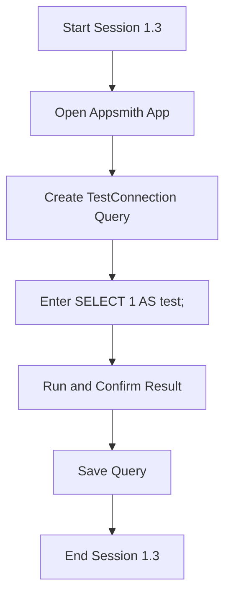

# Session Report - FrogPad - Session 1.3 - Test Simple Query

## Session Title
Test Simple Query in Appsmith

## Date
April 30, 2025

## Objective
Validate the PostgreSQL datasource connection by executing a basic query.

## Steps
1. **Open the Appsmith application**  
   - Navigated to the desired app in Appsmith.
2. **Create new Query**  
   - Under the PostgreSQL datasource, created a query named `TestConnection`.
3. **Enter SQL**  
   ```sql
   SELECT 1 AS test;
   ```
4. **Run Query**  
   - Ran the query and confirmed the result returned `test = 1`.
5. **Save Query**  
   - Saved the `TestConnection` query for future use.

## Deliverable
- Confirmed successful execution of `SELECT 1` query via Appsmith.

## Duration
Approximately 5 minutes.

## Flow Diagram


## 🧠 Memory Reset Recovery Note
To resume: verify the `TestConnection` query returns `1` before building dashboard metrics.
